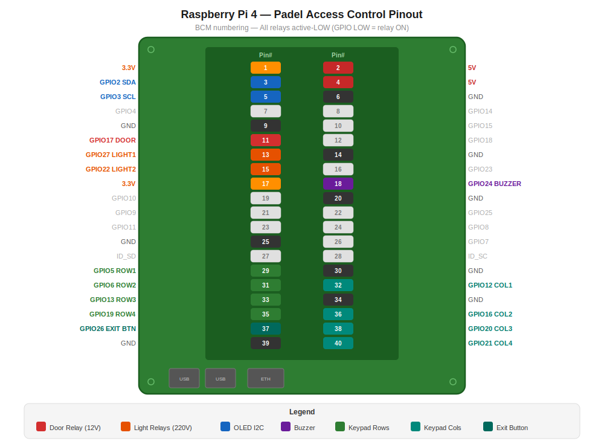

# Padel Facility Access Control System

Raspberry Pi 4 (Ubuntu Server 24) based access control for a padel facility. Controls a door lock (12V relay) and lights (220V relays) via keypad input and REST API, exposed publicly via Cloudflare Tunnel.

**Repository:** https://github.com/trongio/padel-access.git

## Features

- 3x4 keypad code entry with OLED display feedback
- Door lock relay (12V) with configurable unlock duration
- 2 light zone relays (220V) with scheduled auto-off
- One-time and multi-use access codes
- Auto-generate random codes for booking integration
- REST API for remote control and code management
- Runtime-mutable settings (durations, language, log level, alarm toggles…) persisted across reboots
- Operating modes: `normal`, `keypad_disabled`, `free` (door always open + lights on)
- Remote reboot endpoint
- Cloudflare Tunnel for secure public access
- Audit logging for all door, light, settings, mode and reboot events
- Graceful hardware degradation (runs API-only without hardware)

## Hardware Wiring

<p align="center">
  
</p>

| # | Item | Connection | Purpose |
|---|------|------------|---------|
| 1 | 1-Ch 5V Relay Module (AR0310) | GPIO 17 | Door lock — 12V |
| 2 | 12-Ch 5V Relay Module — Relay 1 | GPIO 27 | Light zone 1 — 220V |
| 3 | 12-Ch 5V Relay Module — Relay 2 | GPIO 22 | Light zone 2 — 220V |
| 4 | 3x4 Matrix Keypad (12 keys, 7 pins) | GPIO 5,6,13,19 (rows) / 12,16,20 (cols) | Code input |
| 5 | 0.96" OLED I2C SSD1306 (128x64) | I2C SDA=GPIO2, SCL=GPIO3 | Display |
| 6 | Exit Button (NO momentary) | GPIO 26 (pull-up) | Door release from inside |
| 7 | Active Buzzer (5V) | GPIO 24 | Audio feedback |
| 8 | Magnetic Reed Sensor (NO) | GPIO 23 (pull-up) | Door close detection — magnet contacts when door is closed |

> All relay modules are **active-LOW** (GPIO LOW = relay ON).

### Buzzer Wiring

```
GPIO 24 → 1kΩ resistor → NPN transistor base (2N2222/BC547)
                          collector → buzzer negative
                          buzzer positive → 5V
                          emitter → GND
```

GPIO HIGH = buzzer ON.

## Installation

```bash
# 1. Clone to Pi
git clone https://github.com/trongio/padel-access.git /opt/padel-access
cd /opt/padel-access

# 2. Run interactive setup (installs deps, I2C, .env wizard, systemd)
sudo bash scripts/init.sh

# 3. Reboot if I2C was just enabled
sudo reboot

# 4. Verify I2C (should show 3c for the OLED)
i2cdetect -y 1

# 5. Start
sudo bash scripts/start.sh

# 6. Check status
sudo bash scripts/status.sh
```

## Management

```bash
sudo bash scripts/start.sh     # Start and enable services
sudo bash scripts/stop.sh      # Stop and disable services
sudo bash scripts/restart.sh   # Restart both services
sudo bash scripts/status.sh    # Show status + tunnel URL + health
```

## API Usage

All endpoints (except `/api/health`) require: `Authorization: Bearer <API_KEY>`

A [Postman collection](Padel_Access_API.postman_collection.json) is included for easy API testing and client handoff.

### Health Check

```bash
curl https://your-host.example.com/api/health
```

### Create Access Code

```bash
curl -X POST https://your-host.example.com/api/codes \
  -H "Authorization: Bearer YOUR_API_KEY" \
  -H "Content-Type: application/json" \
  -d '{
    "code": "1234",
    "light_ids": [1, 2],
    "valid_from": "2026-04-05T08:00:00",
    "valid_until": "2026-04-05T22:00:00",
    "label": "Court 1 - John",
    "max_uses": null
  }'
```

Set `max_uses` to `1` for a one-time code, or `null` for unlimited uses.

### Generate Random Code

```bash
curl -X POST https://your-host.example.com/api/codes/generate \
  -H "Authorization: Bearer YOUR_API_KEY" \
  -H "Content-Type: application/json" \
  -d '{
    "light_ids": [1, 2],
    "valid_from": "2026-04-05T08:00:00",
    "valid_until": "2026-04-05T22:00:00",
    "label": "Walk-in Customer",
    "max_uses": 1,
    "code_length": 6
  }'
```

Returns the generated code in the response. Ideal for booking system integration.

### List Codes

```bash
curl https://your-host.example.com/api/codes?active_only=true \
  -H "Authorization: Bearer YOUR_API_KEY"
```

### Remote Door Unlock

```bash
curl -X POST https://your-host.example.com/api/control/door \
  -H "Authorization: Bearer YOUR_API_KEY"
```

### Remote Light Control

```bash
# Turn on (until = auto-off time)
curl -X POST https://your-host.example.com/api/control/lights \
  -H "Authorization: Bearer YOUR_API_KEY" \
  -H "Content-Type: application/json" \
  -d '{"light_ids": [1, 2], "action": "on", "until": "2026-04-05T22:00:00"}'

# Turn off specific zones
curl -X POST https://your-host.example.com/api/control/lights \
  -H "Authorization: Bearer YOUR_API_KEY" \
  -H "Content-Type: application/json" \
  -d '{"light_ids": [1], "action": "off"}'

# Emergency: turn off all lights
curl -X POST https://your-host.example.com/api/control/lights \
  -H "Authorization: Bearer YOUR_API_KEY" \
  -H "Content-Type: application/json" \
  -d '{"action": "off_all"}'
```

### Relay Status

```bash
curl https://your-host.example.com/api/control/status \
  -H "Authorization: Bearer YOUR_API_KEY"
```

### Door Status (reed sensor)

```bash
curl https://your-host.example.com/api/control/door/status \
  -H "Authorization: Bearer YOUR_API_KEY"
```

Returns `{"sensor_available": true, "closed": true|false, "lock_engaged": true|false}`.
`closed` reflects the magnetic reed sensor; `lock_engaged` reflects the door relay.
`closed` is `null` when the sensor is disabled or failed to initialize.

### List Codes With Status

```bash
curl https://your-host.example.com/api/codes/with-status \
  -H "Authorization: Bearer YOUR_API_KEY"
```

Returns every code together with its derived status (`active`, `not_yet_valid`, `expired`, `used`, `inactive`), `uses_remaining`, and the full date set in one round-trip — saves dashboard clients from calling `/api/codes/check` per row.

### Settings

```bash
# Read every runtime-mutable setting
curl https://your-host.example.com/api/settings \
  -H "Authorization: Bearer YOUR_API_KEY"

# Change one or more settings (partial body supported)
curl -X PATCH https://your-host.example.com/api/settings \
  -H "Authorization: Bearer YOUR_API_KEY" \
  -H "Content-Type: application/json" \
  -d '{"door_unlock_duration": 7, "buzzer_enabled": true, "log_level": "DEBUG"}'
```

Changes are persisted to `data/runtime_settings.json` and survive a reboot. Hardware-shape settings (GPIO pins, port, `API_KEY`, `DOOR_SENSOR_ENABLED`) are intentionally **not** mutable at runtime — edit `.env` and reboot.

**Mutable keys:** `door_unlock_duration` (1–60), `mask_code_input` (bool), `buzzer_enabled` (bool), `door_open_alarm_enabled` (bool), `door_open_alarm_seconds` (5–600), `display_idle_text`, `display_idle_subtext`, `app_lang` (`EN`/`KA`), `log_level`, `code_length` (4–8).

Unknown keys and any attempt to set `system_mode` are rejected with 422 — use the dedicated mode endpoint.

### System Mode

```bash
# Get current mode
curl https://your-host.example.com/api/system/mode \
  -H "Authorization: Bearer YOUR_API_KEY"

# Switch mode (normal | keypad_disabled | free)
curl -X POST https://your-host.example.com/api/system/mode \
  -H "Authorization: Bearer YOUR_API_KEY" \
  -H "Content-Type: application/json" \
  -d '{"mode": "free"}'
```

| Mode | Behavior |
|------|----------|
| `normal` | Keypad active, exit button works, remote unlock pulses for `door_unlock_duration` seconds |
| `keypad_disabled` | Keypad ignored; exit button + remote unlock still pulse the door |
| `free` | Door relay held energized indefinitely (door stays open), all light relays held on, keypad ignored, buzzer suppressed, door-open alarm silenced. Display shows `FREE MODE / door open`. |

The mode is persisted, so the device comes back up in the same mode after a reboot. While in free mode, `POST /api/control/door` returns `{"status": "free_mode_noop"}` instead of pulsing the relay.

### Reboot

```bash
curl -X POST https://your-host.example.com/api/system/reboot \
  -H "Authorization: Bearer YOUR_API_KEY" \
  -H "Content-Type: application/json" \
  -d '{"confirm": true}'
```

Requires `"confirm": true` in the body and is rate-limited to **1 call per minute**. Returns `202 Accepted` immediately; the actual reboot fires from a worker thread one second later so the response has time to flush.

### Audit Logs

```bash
curl "https://your-host.example.com/api/logs?limit=50&event=DOOR_OPEN" \
  -H "Authorization: Bearer YOUR_API_KEY"
```

**Event types:** `DOOR_OPEN`, `DOOR_OPENED`, `DOOR_CLOSED`, `DOOR_ALARM`, `DOOR_ALARM_CLEARED`, `LIGHT_ON`, `LIGHT_OFF`, `CODE_FAIL`, `REMOTE_DOOR`, `REMOTE_LIGHT`, `SETTINGS_UPDATE`, `MODE_CHANGE`, `SYSTEM_REBOOT`

## Project Structure

```
padel-access/
├── main.py                       # Entry point: startup, keypad flow, shutdown
├── app/
│   ├── config.py                 # Environment config loader (.env baseline)
│   ├── api/
│   │   ├── router.py             # FastAPI router, auth, health, logs
│   │   └── endpoints/
│   │       ├── codes.py          # Codes CRUD + generate + with-status
│   │       ├── control.py        # Door/light remote control
│   │       └── system.py         # Settings, system mode, reboot
│   ├── core/
│   │   ├── database.py           # SQLite engine, sessions, migrations
│   │   ├── models.py             # SQLModel tables + Pydantic schemas
│   │   ├── scheduler.py          # APScheduler with job persistence
│   │   └── runtime_settings.py   # JSON overlay for runtime-mutable settings
│   ├── hardware/
│   │   ├── relay.py              # Thread-safe GPIO relay controller
│   │   ├── keypad.py             # 3x4 matrix keypad (pad4pi)
│   │   ├── display.py            # OLED SSD1306 queue-based display
│   │   ├── buzzer.py             # Active buzzer with beep patterns
│   │   ├── button.py             # Exit button with edge detection
│   │   └── door_sensor.py        # Magnetic reed sensor (door open/closed)
│   └── services/
│       ├── access.py             # Code validation + use tracking
│       ├── light_manager.py      # Light zones with auto-off scheduling
│       └── system_mode.py        # Operating mode controller + unlock funnel
├── data/
│   ├── padel_access.db           # SQLite (codes + audit log)
│   └── runtime_settings.json     # Persisted setting overrides + system_mode
├── scripts/                      # init, start, stop, restart, status
├── systemd/                      # padel-access.service, padel-tunnel.service
├── Padel_Access_API.postman_collection.json
├── .env.example
└── requirements.txt
```

## Environment Variables

See [`.env.example`](.env.example) for all configuration options.

Key settings:
- `API_KEY` — Bearer token for API authentication
- `TZ` — Timezone for display (e.g. `Asia/Tbilisi`)
- `DOOR_UNLOCK_DURATION` — Seconds to keep door unlocked (default: 5)
- `CF_TUNNEL_TOKEN` — Cloudflare Tunnel token for public access

## Keypad Operation

1. Enter code digits on keypad (shown as dots on display)
2. Press `#` to submit
3. Press `*` to clear input
4. On success: door unlocks, lights turn on, display shows "Access Granted"
5. On failure: buzzer error tone, display shows error message
6. Input auto-clears after 15 seconds of inactivity
7. One-time codes auto-deactivate after use

## Logs

```bash
# Application logs
journalctl -u padel-access -f

# Tunnel logs
journalctl -u padel-tunnel -f
```
